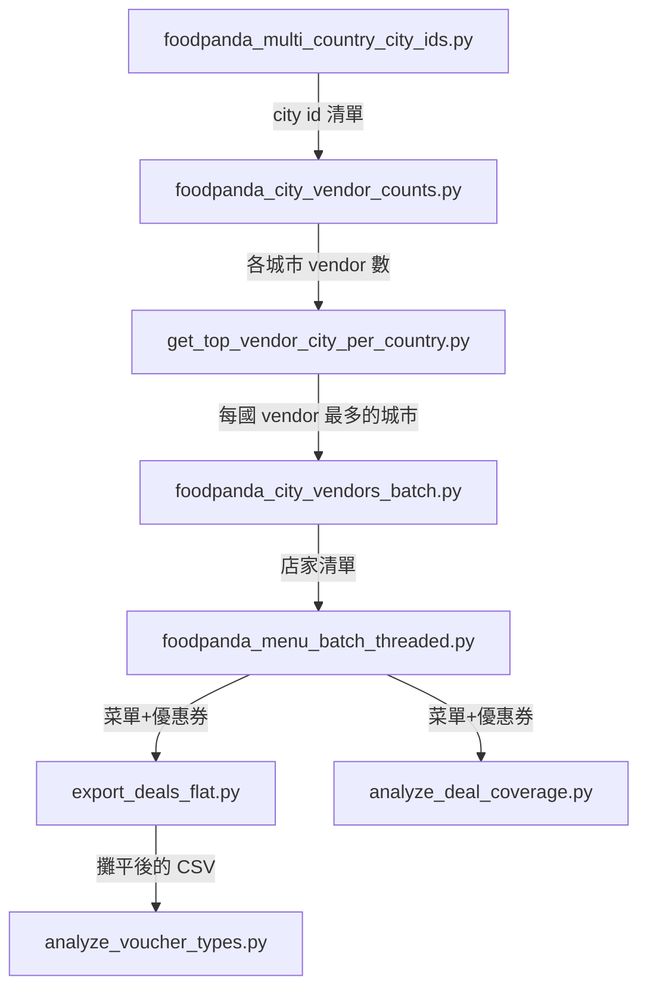

# Foodpanda 多國資料擷取與分析管線 — 使用文件

本文件說明一系列 script如何串接成一條完整的資料管線：從「找出各國有哪些城市」開始，
一路到「擷取店家清單」「擷取菜單與優惠券」，最後「產出分析報表」。

涵蓋國家：Bangladesh (bd)、Cambodia (kh)、Laos (la)、Malaysia (my)、Myanmar (mm)、
Pakistan (pk)、Philippines (ph)。

---

## 一、管線全貌



七個階段依序執行：城市探索 → 城市 vendor 計數 → 選出代表城市 →
取得完整店家清單 → 取得每家店菜單與優惠券 → 攤平 → 分析。

---

## 二、各 script詳細說明

### Stage 1 — 找出各國的城市清單與 city_id

#### `foodpanda_multi_country_city_ids.py`

| 項目 | 內容 |
|---|---|
| 目的 | 掃描 7 國的 `/city` 入口頁，解析出每個城市的 `city_id` |
| 原理 | 從城市頁 HTML 裡的 `city-description-{id}` / `city-internal-link-{id}` 抓數字；若同頁出現多個不同 id（常見於大城市頁面帶「附近熱門城市」推薦區塊），取**出現次數最多**的那個 |
| 輸入 | 無（直接打 `https://www.foodpanda.{domain}/city` 等入口頁） |
| 輸出 | `foodpanda_multi_country_city_ids.csv`（欄位：`國家, 城市名, city id`）<br>`foodpanda_multi_country_city_ids.json`（含 `slug`，供除錯） |
| 常用參數 | `--country pk` 只跑單一國；`--debug` 解析失敗時存 HTML |

**範例輸出**（`foodpanda_multi_country_city_ids.csv` 其中一列）：
```
國家,城市名,city id
Pakistan 巴基斯坦,Karachi,107681
```

---

### Stage 2 — 查詢每個城市有多少家 vendor

#### `foodpanda_city_vendor_counts.py`

| 項目 | 內容 |
|---|---|
| 目的 | 針對 Stage 1 產出的每個 `city_id`，查詢該城市共有多少家餐廳 |
| 原理 | 打 `vendors-gateway` API 並設 `limit=1`，只讀 `available_count` 欄位，不需要取得完整店家清單（省請求數） |
| 輸入 | `foodpanda_multi_country_city_ids.csv`（Stage 1 產出） |
| 輸出 | `foodpanda_city_vendor_counts.csv`（欄位：`國家, 城市名, city_id, vendor_count`） |
| 常用參數 | `--input <csv>`；`--country "Pakistan 巴基斯坦"` 只跑單一國 |

**範例輸出**（`foodpanda_city_vendor_counts.csv` 其中一列）：
```
國家,城市名,city_id,vendor_count
Pakistan 巴基斯坦,Karachi,107681,5256
```

---

### Stage 3 — 從每國挑出 vendor 數最多的城市

#### `get_top_vendor_city_per_country.py`

| 項目 | 內容 |
|---|---|
| 目的 | 在 Stage 2 的結果裡，依「國家」分組，取 `vendor_count` 最大的那一列 |
| 原理 | `pandas.groupby("國家")["vendor_count"].idxmax()` |
| 輸入 | `foodpanda_city_vendor_counts.csv`（**檔名寫死**在程式碼裡） |
| 輸出 | `top_vendor_city_per_country.csv`（每國一列：`國家, 城市名, city_id, vendor_count`） |
| 備註 | 這是純資料處理 script，**不發送任何網路請求** |

**範例輸出**（`top_vendor_city_per_country.csv`，Karachi 是巴基斯坦 vendor 數最多的城市，故雀屏中選）：
```
國家,城市名,city_id,vendor_count
Pakistan 巴基斯坦,Karachi,107681,5256
```

---

### Stage 4 — 取得代表城市的完整店家清單

#### `foodpanda_city_vendors_batch.py`

| 項目 | 內容 |
|---|---|
| 目的 | 針對 Stage 3 選出的每國代表城市，取得該城市**全部**店家的基本資料 |
| 原理 | 沿用 `vendors-gateway` API，用 `offset` 分頁抓到底（無強制上限，API 回空陣列或 `total` 到頂才停） |
| 輸入 | `top_vendor_city_per_country.csv`（Stage 3 產出） |
| 輸出 | `vendor/{國家}_{城市名}_vendors.csv` 與 `.json`，欄位：`name, code, latitude, longitude, category, address, rate_star, rate_number, is_active, is_delivery_enabled, is_pickup_enabled, is_preorder_enabled, is_new, chain_code, chain_name, chain_main_vendor, minimum_order_amount` |
| 內建保護 | 自動偵測並修復輸入 CSV 中「城市名含 HTML 實體導致欄位錯位」的髒資料（如 `Cox&#x27;s Bazar`） |
| 常用參數 | `--total <N>` 每城市上限（預設不設限）；`--debug` 存第一頁原始回應 |

**檔名規則**：`sanitize_filename(國家名)_sanitize_filename(城市名)_vendors.csv`，例如
`Pakistan_巴基斯坦_Karachi_vendors.csv`。**後續所有 script都依賴這個檔名格式**來反解國家/城市。

**已驗證的欄位語意**（用真實回應交叉比對確認，非猜測）：
- `is_active` / `is_delivery_enabled` / `is_pickup_enabled` / `is_preorder_enabled`：列表 API 本身就直接帶營業狀態，不需要另外打詳情 API
- `chain_code` / `chain_name` / `chain_main_vendor`：同一連鎖品牌的分店共用同一組 `chain_code`（例：馬來西亞抽樣 48 家中有 34 家帶連鎖標記）
- 列表 API 裡另有 `discounts_info` 欄位（`{id, value}`），驗證後確認 `id` 就是 Stage 5 `deals` 裡的 `voucher_code`——是同一批優惠券的精簡預覽版，不是新資料，因此本管線不特別擷取此欄位

**範例輸出**（`vendor/Pakistan_巴基斯坦_Karachi_vendors.csv` 其中一列，店名為示意用途）：
```
name,code,latitude,longitude,category,address,rate_star,rate_number,is_active,is_delivery_enabled,is_pickup_enabled,chain_code
Sample Kebab House,ep68,24.8607,67.0011,"Pakistani, BBQ","Block 6, PECHS, Karachi",4.3,512,True,True,False,
```

---

### Stage 5 — 取得每家店的菜單與優惠券

#### `foodpanda_menu_batch_threaded.py`

| 項目 | 內容 |
|---|---|
| 目的 | 針對 `vendor/*.csv` 裡的每家店，取得完整菜單（`menu`）與優惠券（`deals`） |
| 原理 | 呼叫 `{code}.fd-api.com/api/v5/vendors/{vendor_code}` REST API；查詢時提供店家所在座標作為配送地址參數，使查詢結果正確反映該店的外送服務範圍 |
| 輸入 | `vendor/` 資料夾下所有符合命名規則的 CSV |
| 輸出 | `menu/{英文國家名}/{英文國家名}_{vendor code}.json`，結構：`{"vendor": {...}, "deals": [...], "menu": [...]}` |
| 擷取模式 | **直接模式**（本機直連）或 **Zyte 模式**（`--zyte`，透過 Zyte API 依國家設定對應地理位置參數發送請求，需設定環境變數 `ZYTE_API_KEY`） |

**`foodpanda_menu_batch_threaded.py` 的主要能力**：

- `--workers 5`：5 個 thread 併發處理
- 任務以「輪流交錯」方式排隊（國 A 第 1 家、國 B 第 1 家、國 C 第 1 家…），讓多國同時有進度
- `--per-country-limit 400`：每國最多成功抓 400 家就停止，用「原子化佔位 + 失敗釋放名額」機制確保多執行緒下精準不超標
- `--exclude Taiwan Bangladesh`：排除特定國家（預設排除這兩國）

支援參數：`--vendor-dir`、`--menu-dir`、`--workers`、`--per-country-limit`、`--exclude`、`--zyte`、`--debug`。

**範例輸出**（`menu/Pakistan/Pakistan_ep68.json`，內容為簡化示意）：
```json
{
  "vendor": {"code": "ep68", "name": "Sample Kebab House", "rating": 4.3, "address": "Block 6, PECHS, Karachi"},
  "deals": [
    {"description": "20% off", "type": "percentage", "value": 20,
     "voucher_code": "welcome20", "min_order_value": 500, "end_date": "2026-08-31"}
  ],
  "menu": [
    {"category": "Mains", "item_count": 1, "items": [
      {"name": "Chicken Karahi", "price": 850, "price_discounted": null, "is_sold_out": false}
    ]}
  ]
}
```


---

### Stage 6 — 把菜單資料攤平成分析用的表格

#### `export_deals_flat.py`

| 項目 | 內容 |
|---|---|
| 目的 | 把 `menu/` 底下數千個小 JSON 檔，攤平成兩個大 CSV，方便後續分析或上傳 |
| 輸入 | `menu/{country}/*.json`（Stage 5 產出） |
| 輸出 | `all_deals_flat.csv`（每列 = 一張優惠券）<br>`all_vendors_flat.csv`（每列 = 一家店，含 `deal_count`） |

`all_deals_flat.csv` 欄位：`country, vendor_code, vendor_name, description, type, value, voucher_code, min_order_value, max_discount, end_date, is_new_customer, terms`

**範例輸出**（承接 Stage 5 的例子）：
```
country,vendor_code,vendor_name,description,type,value,voucher_code,min_order_value
Pakistan,ep68,Sample Kebab House,20% off,percentage,20,welcome20,500
```

> ⚠️ 目前只讀取 `deals` 欄位。詳情 API 另有一個獨立的 `discounts` 欄位（概念上是「店家全店折扣、不需券碼」），但 7 國抽樣資料中此欄位全部是空陣列，暫無實際內容可分析，故未納入攤平流程。

---

### Stage 7 — 分析

#### `analyze_deal_coverage.py`

| 項目 | 內容 |
|---|---|
| 目的 | 各國「有優惠 / 沒優惠」店家佔比；優惠數量的 histogram |
| 輸入 | `menu/` 資料夾（**直接讀 JSON，不需要 Stage 6 的攤平檔**） |
| 輸出 | `analysis/deal_summary.csv`、`analysis/deal_count_histogram.csv`、`analysis/deal_histogram.png`（需要 `matplotlib`，沒裝會自動跳過畫圖但 CSV 照常輸出） |

**範例輸出**（終端機統計表格式）：
```
國家           總店數    有優惠      比例    沒優惠      比例
Pakistan        400       224    56.0%      176    44.0%
```

#### `analyze_voucher_types.py`

| 項目 | 內容 |
|---|---|
| 目的 | 優惠券**歸屬分類**（店家專屬 / 小範圍共用 / 平台通用）與**折扣結構分類**（滿額打折 / 直接打折 / 滿額折抵金額 / 直接折抵金額 / 其他） |
| 輸入 | `all_deals_flat.csv`（**需要 Stage 6 先跑過**） |
| 輸出 | `voucher_analysis/voucher_classification_all.csv`（全部國家明細）<br>`voucher_analysis/by_country/{國家}_classification.csv` 與 `{國家}_summary.csv`（依國家分開輸出） |
| 前置處理 | 用 `(國家, vendor_code, description, type, value, min_order_value, max_discount, end_date)` 當「方案特徵」去重，避免同一優惠被拆成多組券碼而灌水（例如寮國曾出現同一方案拆成 18 組券碼的情況） |
| 歸屬判斷邏輯 | 同一券碼在同一國家橫跨幾家不同的店：`1 家 → 店家專屬`、`2~50 家 → 小範圍共用`、`>50 家 → 平台通用`（門檻可用 `--platform-threshold` 調整） |

**範例輸出**（此 script 共產生 3 種輸出檔案，以下分別示意）：

① `voucher_analysis/voucher_classification_all.csv`（全部國家明細，欄位為原始資料加上分類結果）：
```
country,vendor_code,vendor_name,description,type,value,voucher_code,min_order_value,n_vendors,scope,structure
Pakistan,ep68,Sample Kebab House,20% off,percentage,20,welcome20,500,1,店家專屬,滿額打折
Malaysia,c4a9,Sample Noodle Bar,15% off min RM25,percentage,15,promo1147,25,3,小範圍共用,滿額打折
Bangladesh,nb43,Sample Biryani House,60% off,percentage,60,newuser88,99,4507,平台通用,滿額打折
```

② `voucher_analysis/by_country/Pakistan_classification.csv`（與①同欄位，但只留 Pakistan 那些列）：
```
country,vendor_code,vendor_name,description,type,value,voucher_code,min_order_value,n_vendors,scope,structure
Pakistan,ep68,Sample Kebab House,20% off,percentage,20,welcome20,500,1,店家專屬,滿額打折
```

③ `voucher_analysis/by_country/Pakistan_summary.csv`（該國「歸屬 x 結構」交叉表）：
```
scope        直接打折   滿額打折
店家專屬        164        60
```

> 補充：「小範圍共用」類別原本推測可能是連鎖店，Stage 4 新增的 `chain_code` 欄位可用來實際驗證這個假設，但目前 Stage 6/7 的攤平流程尚未把 `chain_code` 一併帶入優惠券分析。

---

## 三、共用技術慣例

所有 script共用以下設計，讀懂一次即可通用：

### 國家代碼對照表
多數 script內都有一份 `COUNTRY_CODE_MAP`（中英文國名 → 2 碼國別代碼）與
`SITE_DOMAIN_MAP`（國別代碼 → 官網網域尾碼，例如 `bd → com.bd`、`pk → pk`），
這兩份對照表在各 script間是**複製貼上維護**，並非共用模組，修改時要注意同步。

### `vendors-gateway` API
Stage 1~4 都是打同一支 API：
```
GET https://{code}.fd-api.com/vendors-gateway/api/v1/pandora/vendors
    ?configuration=&country={code}&city_id={id}&include=&language_id=1
    &sort=&offset={offset}&limit={limit}&vertical=restaurants
```
差別只在 `limit=1`（只要總數）還是分頁抓全部、以及 `city_id` 是單一還是多筆。
單一 vendor 物件實際回傳 80+ 個欄位（付款方式、外送費規則、連鎖資訊等），
各資料擷取 script的 `extract_fields()` 只挑取其中一部分寫入 CSV。

### `--debug` 慣例
幾乎每支需要發請求的 script都支援 `--debug`，行為是「解析失敗或請求出錯時，
把原始回應/HTML 存成本地檔案」，方便回報問題或手動排查。

---

## 四、已知限制與待辦事項

| 項目 | 說明 | 影響 |
|---|---|---|
| **`get_top_vendor_city_per_country.py` 檔名寫死** | `input_file = 'foodpanda_city_vendor_counts.csv'` 沒有做成參數 | 需確保執行目錄下有這個確切檔名，或手動改程式碼裡的路徑 |
| **`export_deals_flat.py` 未納入 `discounts` 欄位** | 該欄位在抽樣資料中全部是空陣列，暫無法確認其真實用途與觸發條件 | 若未來該欄位開始有資料，目前的攤平流程會遺漏它 |
| **無法取得訂單/銷量資料** | 已確認兩支主要 API（列表、詳情）共 80+ 欄位裡完全沒有訂單數、銷量等欄位；`review_number` 只能當粗略方向性代理指標，且非「當日」數字 | 若需要銷量趨勢，只能長期定期重跑並觀察 `review_number` 成長速度，無法取得精確訂單數 |
| **各 script間的國家/網域對照表未模組化** | 見上方「國家代碼對照表」一節 | 新增國家或網域變動時，需要逐一檔案手動同步修改 |

---

## 五、端到端執行範例

```bash
# Stage 1：找出 7 國的城市與 city_id
python foodpanda_multi_country_city_ids.py

# Stage 2：查每個城市的 vendor 數量
python foodpanda_city_vendor_counts.py --input foodpanda_multi_country_city_ids.csv

# Stage 3：每國挑出 vendor 最多的城市
python get_top_vendor_city_per_country.py
# （確認當前目錄下有 foodpanda_city_vendor_counts.csv）

# Stage 4：取得代表城市的完整店家清單
python foodpanda_city_vendors_batch.py --input top_vendor_city_per_country.csv

# Stage 5：取得每家店的菜單與優惠券（多執行緒、排除台灣/孟加拉、每國上限 400 家）
python foodpanda_menu_batch_threaded.py --workers 5 --per-country-limit 400

# Stage 6：攤平成分析用 CSV
python export_deals_flat.py

# Stage 7：跑分析
python analyze_deal_coverage.py
python analyze_voucher_types.py --input all_deals_flat.csv
```

---

## 六、輸出檔案總覽

```
foodpanda_multi_country_city_ids.csv      Stage 1
foodpanda_city_vendor_counts.csv          Stage 2
top_vendor_city_per_country.csv           Stage 3
vendor/
  {國家}_{城市名}_vendors.csv             Stage 4（每國一份，含店家基本資料）
menu/
  {英文國家名}/
    {英文國家名}_{vendor_code}.json       Stage 5（每店一份，含菜單+優惠券）
  _fetch_summary_threaded.json            Stage 5 執行總結
all_deals_flat.csv, all_vendors_flat.csv  Stage 6
analysis/
  deal_summary.csv, deal_count_histogram.csv, deal_histogram.png     Stage 7
voucher_analysis/
  voucher_classification_all.csv
  by_country/{國家}_classification.csv, {國家}_summary.csv          Stage 7
```